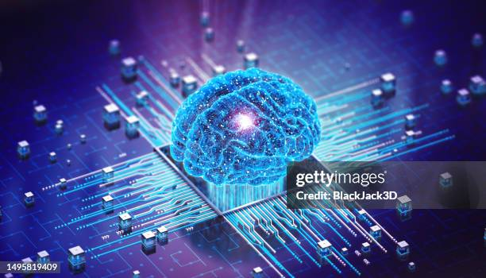

# *Influencia de las IAs en el Aprendizaje Humano*

## **Desarrollos recientes en Inteligencia Artificial _(IA)_**
 
### La IA ha avanzado notablemente gracias a tres factores clave: el desarrollo de procesadores gráficos especializados, la disponibilidad masiva de datos y los entornos de programación de código abierto para el aprendizaje automático. Estos avances han permitido la creación de modelos de redes neuronales profundas que pueden procesar y aprender de grandes volúmenes de datos, facilitando tareas como el reconocimiento de imágenes, la traducción automática y la predicción de comportamientos.

---
+ IA
+ Educación
---
| Visión de futuro  | Desafíos y consideraciones éticas |
| ------------- | ------------- |
| Las instituciones educativas deben repensar su papel en una sociedad donde la IA está cada vez más presente.  | La privacidad y la seguridad de los datos de los estudiantes son asuntos que preocupan al sector.  |
---

> La inteligencia artificial ofrece enormes oportunidades para transformar la educación, mejorando el aprendizaje y adaptándose a las necesidades individuales de los estudiantes.

---
> [!WARNING]
### **Las IAs pueden ser peligrosas si no se usan correctamente.**
---

---

[Fuente](https://megaprofe.es/impacto-de-la-inteligencia-artificial-en-el-aprendizaje/?)